# Phase 2 WAL Architecture - Visual Guide

Core-X Phase 2 "Trusted Persistence" 구현의 시각화 문서입니다.

---

## 1. 전체 시스템 아키텍처

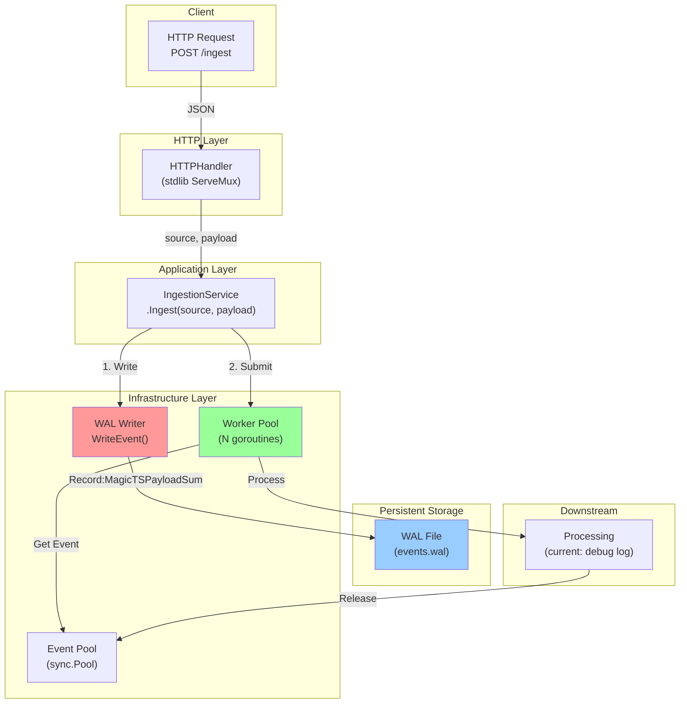

---

## 2. Crash Recovery 플로우

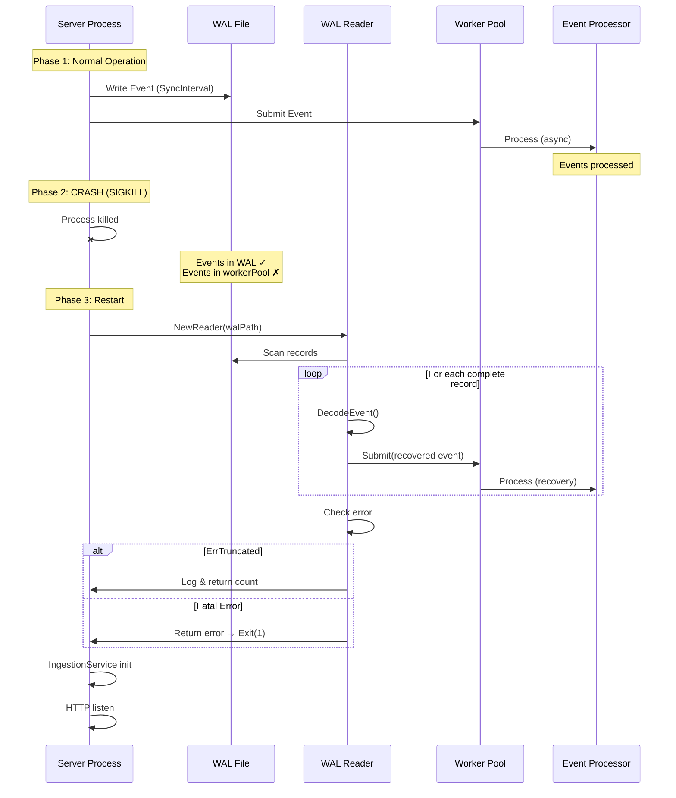

---

## 3. WAL Reader 상태 머신

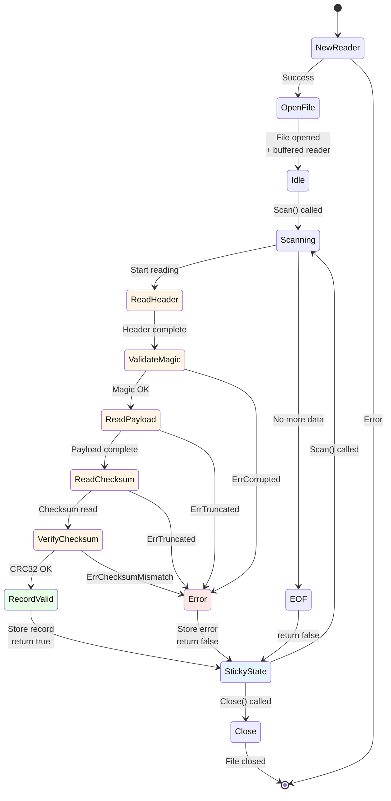

---

## 4. 에러 분류 결정 트리

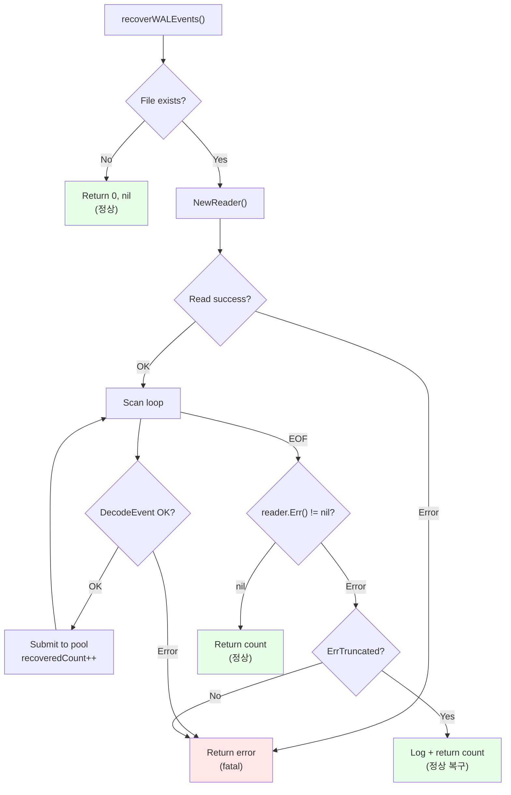

---

## 5. E2E 테스트 시나리오

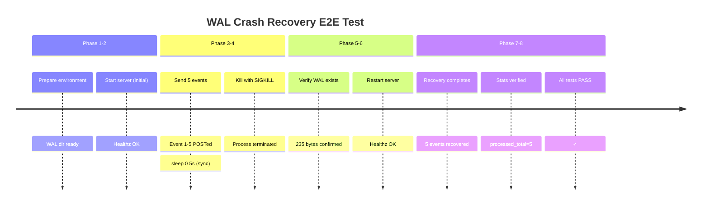

---

## 6. 데이터 흐름: 쓰기 경로 (Ingest)

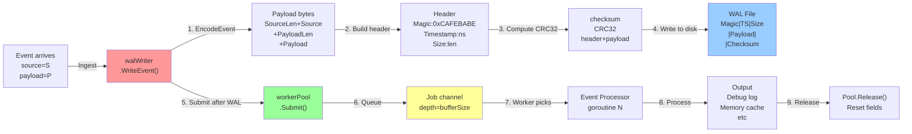

---

## 7. 데이터 흐름: 복구 경로 (Recovery)

```mermaid
graph LR
    A["Server restart<br/>after crash"] -->|recoverWALEvents| B["NewReader<br/>walPath"]

    B -->|Open & buffer| C["WAL File<br/>(existing)"]

    C -->|reader.Scan()| D["Read header<br/>16 bytes"]

    D -->|io.ReadFull| E{"All bytes?"}

    E -->|No: EOF| F["return false<br/>Err()=nil"]
    E -->|No: Partial| G["return false<br/>Err()=ErrTruncated"]
    E -->|Yes| H["Validate magic<br/>0xCAFEBABE"]

    H -->|Invalid| I["return false<br/>Err()=ErrCorrupted<br/>EXIT 1"]
    H -->|Valid| J["Read payload<br/>N bytes"]

    J -->|Complete| K["Read checksum<br/>4 bytes"]
    K -->|Complete| L["CRC32 verify<br/>header+payload"]

    L -->|Match| M["DecodeEvent<br/>get Event"]
    L -->|Mismatch| N["Err()=ErrChecksum<br/>EXIT 1"]

    M -->|ReceivedAt←<br/>Timestamp| O["Event ready"]
    O -->|submitter.Submit| P["workerPool<br/>.Submit()"]

    P -->|Queue| Q["Job channel"]
    Q -->|recoveredCount++| R["Next record"]

    R -->|reader.Scan()| D

    F -->|Check error| S{"ErrTruncated?"}
    G -->|Check error| S
    S -->|Yes| T["Log + return count<br/>(정상)"]
    S -->|No| U["Log error<br/>EXIT 1"]

    style A fill:#fff4e6
    style C fill:#99ccff
    style M fill:#e6ffe6
    style P fill:#99ff99
    style T fill:#e6ffe6
    style U fill:#ffe6e6
```

---

## 8. Graceful Shutdown 순서

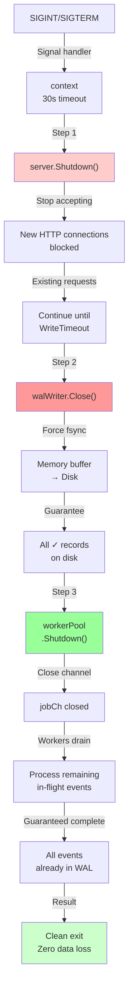

---

## 9. 에러 분류 의미

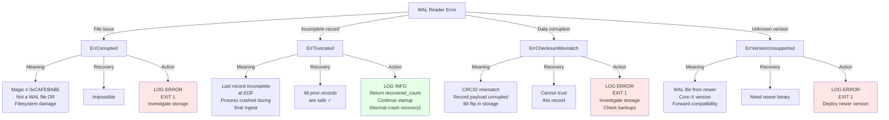

---

## 10. 메모리 레이아웃: Record 구조

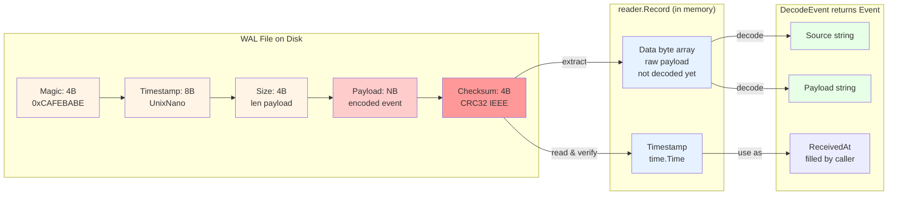

---

## 11. 테스트 커버리지 매트릭스

```mermaid
graph TB
    A["reader_test.go<br/>10 tests<br/>54.7% coverage"] -->|Core| B["TestReader_EmptyFile<br/>✓ EOF handling"]
    A -->|Core| C["TestReader_SingleRecord<br/>✓ Basic read+decode"]
    A -->|Core| D["TestReader_MultipleRecords<br/>✓ Sequential iteration"]

    A -->|Crash Recovery| E["TestReader_TailTruncation<br/>✓ 99/100 recovered<br/>✓ ErrTruncated"]
    A -->|Crash Recovery| F["TestReader_HeaderTruncation<br/>✓ Partial header"]

    A -->|Data Integrity| G["TestReader_CorruptedMagic<br/>✓ Invalid magic<br/>✓ ErrCorrupted"]
    A -->|Data Integrity| H["TestReader_ChecksumMismatch<br/>✓ CRC32 failure<br/>✓ Detected"]

    A -->|Decoding| I["TestDecodeEvent_RoundTrip<br/>✓ 5 subtests<br/>✓ Empty/normal/large"]
    A -->|Decoding| J["TestDecodeEvent_EdgeCases<br/>✓ 5 boundary tests<br/>✓ Truncation detection"]

    style A fill:#fff4e6
    style B fill:#e6ffe6
    style C fill:#e6ffe6
    style D fill:#e6ffe6
    style E fill:#ffe6e6
    style F fill:#ffe6e6
    style G fill:#ffcccc
    style H fill:#ffcccc
    style I fill:#ccffcc
    style J fill:#ccffcc
```

---

## 12. 성능 특성

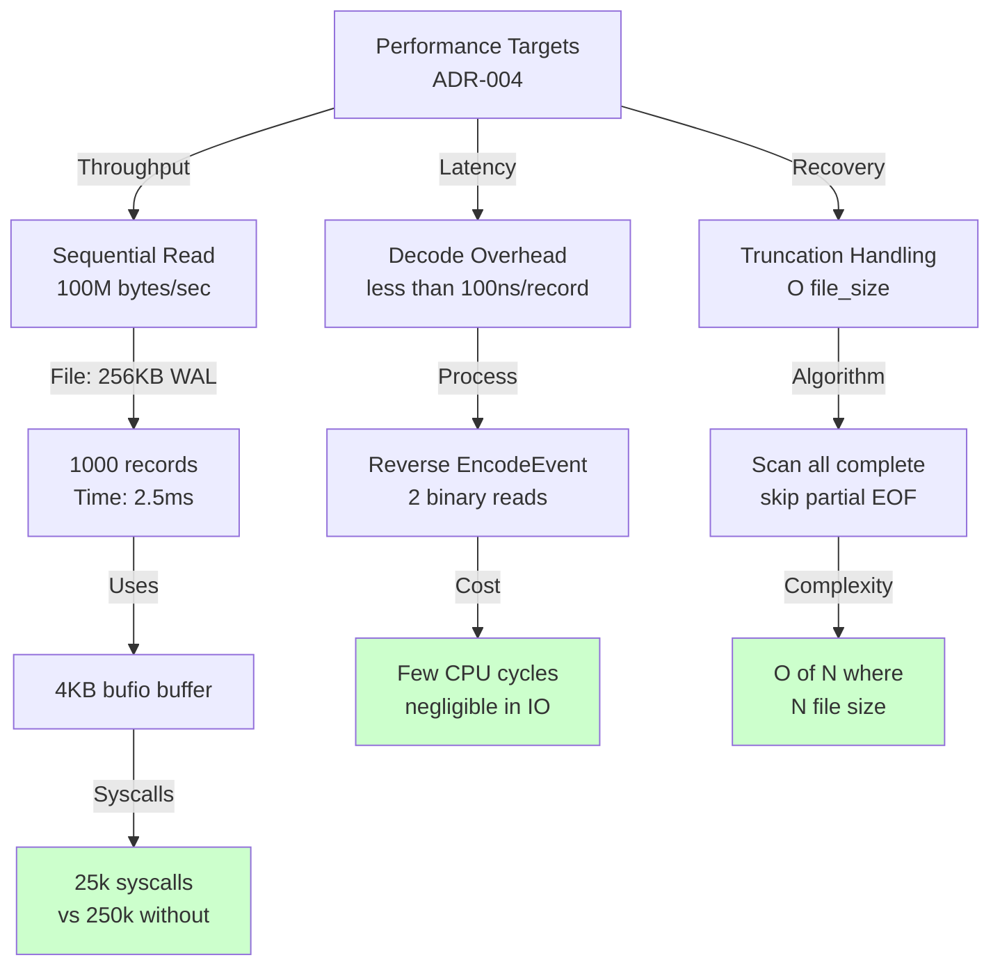

---

## 13. 아키텍처 결정 (ADR-004)

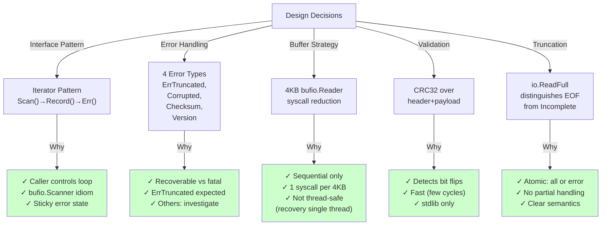

---

## Phase 2 Summary

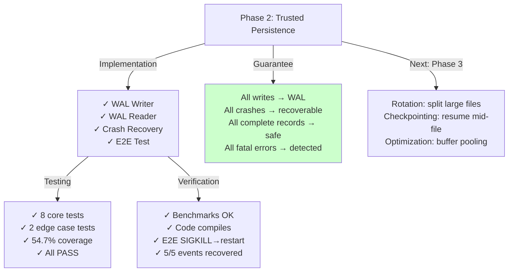

---

## 참고: 파일 구조

```
core-x/
├── docs/
│   ├── adr/
│   │   └── 0004-wal-reader-design.md          (설계 결정)
│   └── PHASE2_WAL_ARCHITECTURE.md             (이 파일)
├── internal/
│   └── infrastructure/storage/wal/
│       ├── reader.go                          (~250 lines)
│       ├── reader_test.go                     (13KB, 10 tests)
│       ├── errors.go                          (sentinel errors)
│       ├── writer.go                          (existing)
│       └── encode.go                          (existing)
├── cmd/
│   └── main.go                                (recovery 통합)
├── scripts/
│   └── test_recovery.sh                       (E2E test)
└── bench/
    └── wal_reader_bench_test.go               (performance)
```
