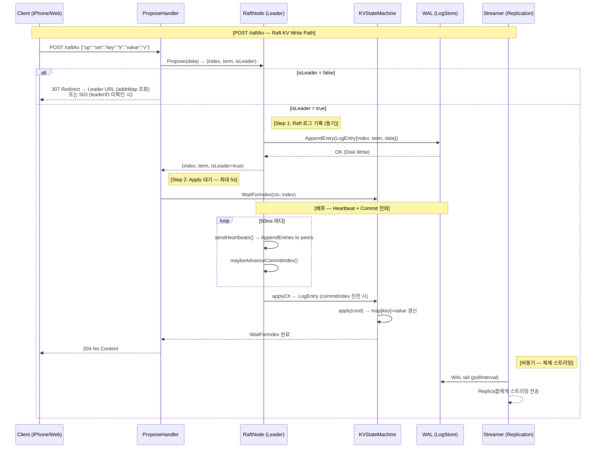

# Core-X 통합 Write Path 시퀀스 다이어그램

> Phase 7 (멀티 노드 통합 완성) 기준 — 리더 선출, WAL 영속화, Raft 합의, 복제 스트리밍이 모두 연결된 상태
>
> **이 문서는 `POST /raft/kv` 경로만 다룬다.** `POST /ingest` 경로(Phase 1~3, Bitcask KVStore)는 `SEQUENCE_DIAGRAMS.md` 참조.

---

## 개요: 왜 이렇게 설계했는가

Core-X의 쓰기 경로는 세 가지 서로 다른 관심사를 동시에 만족해야 한다.

1. **영속성 (Reliability)**: 클라이언트에 OK를 보내기 전에 이벤트가 디스크에 기록되어야 한다. 프로세스 크래시 이후에도 데이터가 손실되지 않는다.
2. **합의 (Reliability + Scalability)**: 단일 노드 장애에도 데이터가 살아남으려면 과반수 복제가 필요하다. Raft를 사용해 리더가 결정하고 팔로워가 따르는 단일 쓰기 순서를 보장한다.
3. **처리량 (Scalability)**: 클라이언트를 응답 지연으로부터 분리하기 위해 비동기 WorkerPool을 사용한다. 복제 스트리밍도 HTTP 응답 경로 밖에서 수행된다.

이 세 관심사는 파이프라인 내에서 책임이 명확히 분리된 컴포넌트로 구현되어 있으며, 시퀀스 다이어그램은 이 컴포넌트들이 하나의 요청을 처리하는 전체 흐름을 보여준다.

---

## 컴포넌트 역할

| 컴포넌트 | Go 타입 / 파일 | 역할 |
|---|---|---|
| **HTTP/gRPC Handler** | `internal/infrastructure/http/propose_handler.go` `ProposeHandler` | 클라이언트 요청 파싱, 리더 여부 확인, redirect 발행, apply 완료 대기 |
| **RaftNode** | `internal/infrastructure/raft/node.go` `RaftNode` | Raft 합의 상태 머신 — Follower/Candidate/Leader 역할 전환, heartbeat, log replication |
| **KVStore (Bitcask)** | `internal/infrastructure/storage/kv/store.go` `Store` | WAL + 인메모리 HashIndex 기반 KV 저장소. WAL write → 인덱스 갱신을 원자적 쌍으로 수행 |
| **WAL Writer** | `internal/infrastructure/storage/wal/writer.go` `Writer` | 순차 바이너리 로그 파일. `[Magic:4][Timestamp:8][Size:4][Payload:N][CRC32:4]` 레코드 포맷. `O_APPEND` 모드로 concurrent-safe |
| **WorkerPool** | `internal/infrastructure/pool/event_pool.go` + executor 패키지 | 비동기 이벤트 처리 분산. 버퍼드 채널 기반 Non-blocking Submit. 응답 경로에서 처리 지연을 격리 |
| **Streamer** | `internal/infrastructure/replication/streamer.go` `Streamer` | WAL 파일을 tail하며 새 레코드를 감지하고, replica에 스트리밍 전송. Compaction 이벤트 시 오프셋 0에서 재시작 |
| **KVStateMachine** | `internal/infrastructure/raft/kv_state_machine.go` `KVStateMachine` | `applyCh`에서 커밋된 LogEntry를 소비하여 인메모리 `map[string]string` 갱신. `WaitForIndex`로 쓰기-후-읽기 선형성 보장 |

---

## 시퀀스 다이어그램



---

## 각 단계 상세 설명

### Step 0: 리더 확인 (Leader Check)

`ProposeHandler.ServeHTTP`는 요청을 처리하기 전에 `RaftNode.Propose(data)`를 호출한다. Propose는 즉시 `(index, term, isLeader)` 를 반환하며 `isLeader=false`이면 handler가 redirect를 발행한다.

```
RaftNode.Propose(data) → (index, term, isLeader)
  isLeader=false → ProposeHandler가 LeaderID() 조회 → 307 Temporary Redirect
  isLeader=true  → 쓰기 경로 진행
```

**307을 선택한 이유**: 클라이언트가 POST body를 동일하게 재전송해야 함을 뜻한다. 리더는 언제든 교체될 수 있으므로 영구 redirect(301/308)는 부적절하다. (ADR-015 참조)

**리더 ID 추적 방법**: `RaftNode`의 `leaderID` 필드는 두 가지 이벤트로 갱신된다.
- `HandleAppendEntries` 수락 시 → `args.LeaderID`로 갱신 (자신이 follower임을 확인)
- `runLeader` 진입 시 → `n.id` (자기 자신)으로 갱신

---

### Step 1: Raft 로그 기록 (WALLogStore)

`RaftNode.Propose(data)`는 `LogEntry`를 로컬 `WALLogStore`에 append하고 즉시 `(index, term, isLeader)`를 반환한다. 커밋은 비동기다.

```
RaftNode.Propose(data)
  └─ WALLogStore.AppendEntry(LogEntry{index, term, data})
       ├─ WAL 파일에 순차 기록 (O_APPEND)
       └─ (index, term, isLeader) 반환
```

**WAL 레코드 포맷**: `[Magic:4][Timestamp:8][Size:4][Payload:N][CRC32:4]`
- CRC32 체크섬으로 부분 기록(torn write) 감지
- `O_APPEND` 모드로 concurrent-safe 순차 기록

> ⚠️ 이 경로의 WAL은 **Raft 로그 전용**(`WALLogStore`)이다. Phase 1~3의 이벤트 수집 경로에서 사용하는 Bitcask `KVStore` WAL과는 별개의 파일이다.

---

### Step 2: Apply 대기 (WaitForIndex)

`ProposeHandler`는 Propose 직후 `KVStateMachine.WaitForIndex(ctx, index)`를 호출하여 해당 index의 LogEntry가 state machine에 적용될 때까지 최대 5초 대기한다.

```
H: sm.WaitForIndex(ctx, index)  ← 최대 5s blocking

배후에서:
  RaftNode.runLeader() → sendHeartbeats() 50ms 마다
    → maybeAdvanceCommitIndex() → commitIndex 진전
  RaftNode.runApplyLoop() → 5ms polling
    → applyCh ← LogEntry
  KVStateMachine.apply(cmd) → map[key]=value 갱신
    → appliedIndex 갱신 → WaitForIndex 반환
```

**Apply 지연**: `applyPollInterval = 5ms`. Propose → 200 응답까지의 최대 추가 지연은 heartbeat(50ms) + apply poll(5ms) = ~55ms다. 정상 단일 노드 환경에서는 `sendHeartbeats` 직후 quorum(1) 달성으로 훨씬 빠르다.

---

### 비동기 복제 (Streamer)

`Streamer`는 WAL 파일을 tail하며 독립적인 고루틴에서 동작한다. HTTP 응답 경로와 완전히 분리된다.

```
Streamer.Stream(ctx, startOffset, fn)
  └─ loop:
       ├─ WAL 파일에서 새 레코드 읽기
       ├─ EOF이면 pollInterval(기본값 설정) 대기
       ├─ compactionCh 신호 수신 시 → 파일을 offset 0에서 재오픈
       └─ fn(RawEntry) 호출 → ReplicationServer가 gRPC stream으로 전송
```

**복제 지연 측정**: `ReplicationLag` 타입이 Streamer 내에서 WAL offset과 replica의 confirmed offset 차이를 추적한다. 이 값은 `/metrics` 엔드포인트에 노출된다. (ADR-008 참조)

---

### Heartbeat 루프 (Raft 합의)

`RaftNode.runLeader`는 `HeartbeatInterval = 50ms` 타이머로 `sendHeartbeats`를 호출한다.

```
runLeader (goroutine)
  └─ ticker := time.NewTicker(50ms)
       └─ sendHeartbeats(ctx, peers, currentTerm)
            ├─ 각 peer에 AppendEntries(entries, leaderCommit) 전송 (별도 goroutine)
            ├─ response로 Term 확인 → 더 높은 term 발견 시 Follower로 강등
            └─ quorum 달성 시 maybeAdvanceCommitIndex() → commitIndex 진전
                 └─ runApplyLoop (5ms polling) → applyCh로 LogEntry 전달
                      └─ KVStateMachine.apply() → 인메모리 map 갱신
```

**단일 노드 예외**: peers가 없는 single-node 배포에서는 `sendHeartbeats` 직후 `maybeAdvanceCommitIndex(term, lastIdx, majority=1)`을 직접 호출하여 quorum을 즉시 달성한다. (ADR-013 참조)

**Apply 지연**: `applyPollInterval = 5ms`. `commitIndex`가 진전된 시점부터 `KVStateMachine`이 해당 엔트리를 적용하기까지의 지연은 최대 5ms다. `WaitForIndex`를 사용하면 이 지연 내에서 쓰기-후-읽기 선형성이 보장된다.

---

## 설계 트레이드오프 및 주의사항

### 1. 비동기 Propose vs 동기 Apply-Wait

`RaftNode.Propose(data)`는 로컬 WALLogStore에 기록 후 즉시 반환한다. 커밋(과반수 복제)은 비동기다. HTTP handler는 `KVStateMachine.WaitForIndex(ctx, index)`로 해당 index가 **로컬 state machine에 apply**될 때까지 최대 5초를 기다린다.

**이 트레이드오프의 의미**: 클라이언트가 204를 받은 시점에 과반수 복제가 완료되었음을 보장하지 않는다. `WaitForIndex`는 로컬 apply까지만 기다린다. 강한 durability가 필요한 경우 apply 이전에 quorum ACK를 기다리는 별도 경로가 필요하다.

### 2. Streamer의 Poll-based Tailing

Streamer는 WAL 파일을 `inotify/kqueue` 대신 polling으로 감시한다. 운영체제 이식성이 높고 구현이 단순하지만, 새 레코드가 기록된 후 최대 `pollInterval`만큼 복제 시작이 지연된다.

**한계**: Raft heartbeat 기반 복제(AppendEntries)와 WAL Streamer 기반 복제는 독립된 두 경로다. Phase 7 이후 현재 구조에서는 이 둘이 중복될 수 있다. 향후 통합 시 복제 경로를 단일화하는 결정이 필요하다.

### 3. Worker Pool 포화 시 데이터 유실

`Submit(event)`가 `false`를 반환하면 해당 이벤트는 WorkerPool에서 처리되지 않는다. 단, WAL에는 이미 기록되어 있으므로 재시작 시 `Recover()`로 인덱스를 재건할 수 있다. WorkerPool이 하는 처리(집계, 로깅 등)만 유실될 수 있다. 현재 아키텍처에서 WorkerPool 처리는 durability-critical 경로가 아니다.

### 4. KVStore (Bitcask) vs KVStateMachine의 이중 저장

다이어그램에서 `KVStore`(Bitcask)와 `KVStateMachine`(인메모리 map)은 서로 다른 컴포넌트다.

- `KVStore`: WAL + HashIndex 기반. Phase 1~4에서 수집 이벤트를 저장하는 원래 스토리지.
- `KVStateMachine`: Raft applyCh를 소비하는 순수 인메모리 상태 머신. Phase 5~7에서 추가된 Raft KV 경로 전용.

현재 두 컴포넌트가 공존하며 각각 다른 쓰기 경로를 담당한다. 향후 통합 시 Raft KV 경로를 KVStore의 쓰기 경로로 연결하는 방안을 검토해야 한다.

---

## 관련 ADR

| ADR | 제목 | 이 다이어그램과의 관련 |
|---|---|---|
| [ADR-002](adr/0002-worker-pool-and-sync-pool-for-performance.md) | Worker Pool + sync.Pool | WorkerPool Submit, backpressure 설계 |
| [ADR-005](adr/0005-hash-index-kv-store-bitcask.md) | KVStore Bitcask | Step 1 WAL + HashIndex 영속화 |
| [ADR-008](adr/0008-basic-replication-async-wal-streaming.md) | 비동기 WAL 스트리밍 복제 | Streamer 복제 경로 |
| [ADR-012](adr/012-raft-log-wal-persistence.md) | Raft 로그 WAL 영속화 | LogStore + WAL 연동 |
| [ADR-013](adr/013-raft-write-path.md) | Raft Write Path (Propose + Apply) | Propose API, applyCh, Heartbeat 루프 |
| [ADR-014](adr/014-raft-kv-state-machine.md) | KVStateMachine + HTTP Propose | KVStateMachine, WaitForIndex |
| [ADR-015](adr/015-raft-leader-redirect-and-multinode-test.md) | Leader Redirect + 멀티 노드 테스트 | 307 Redirect 결정 근거 |
