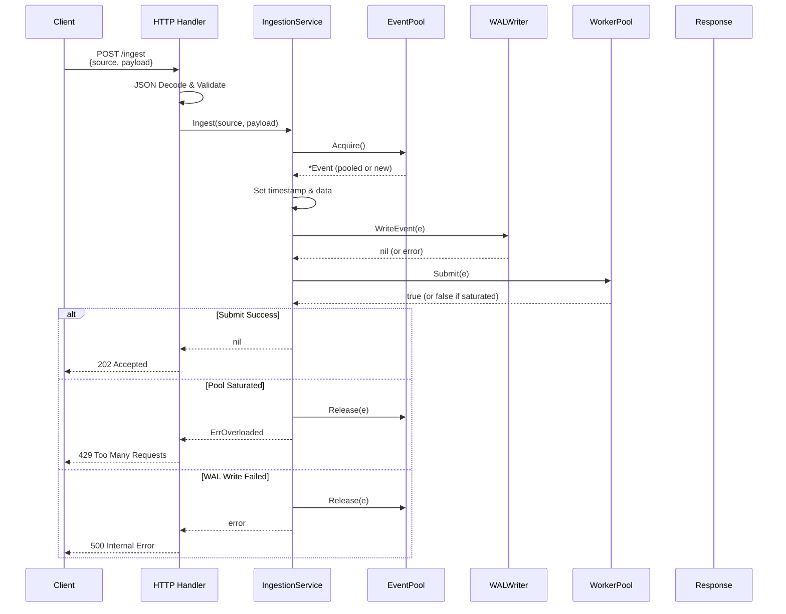
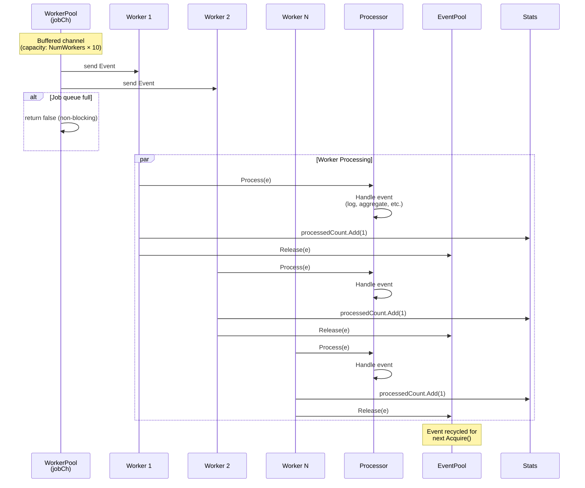
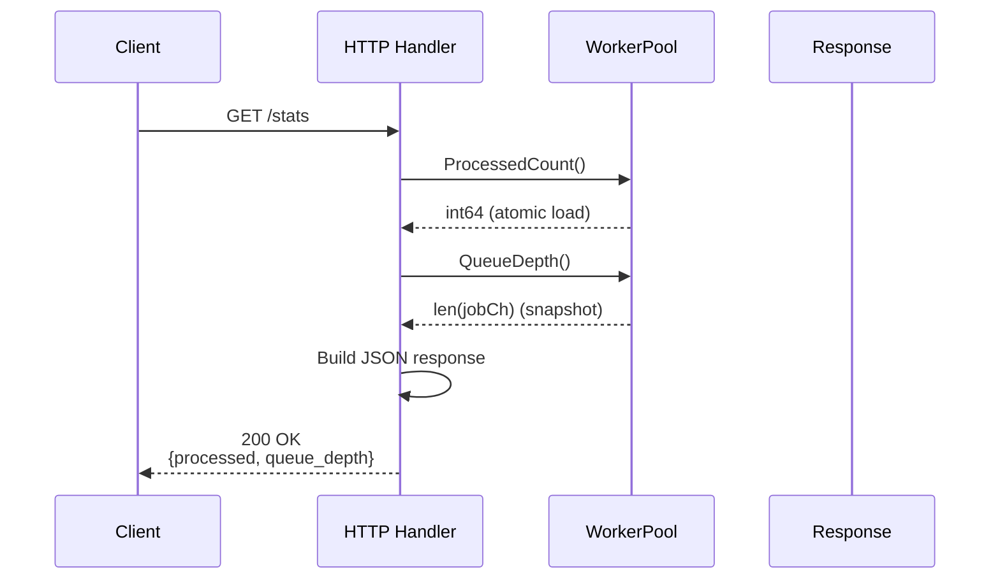
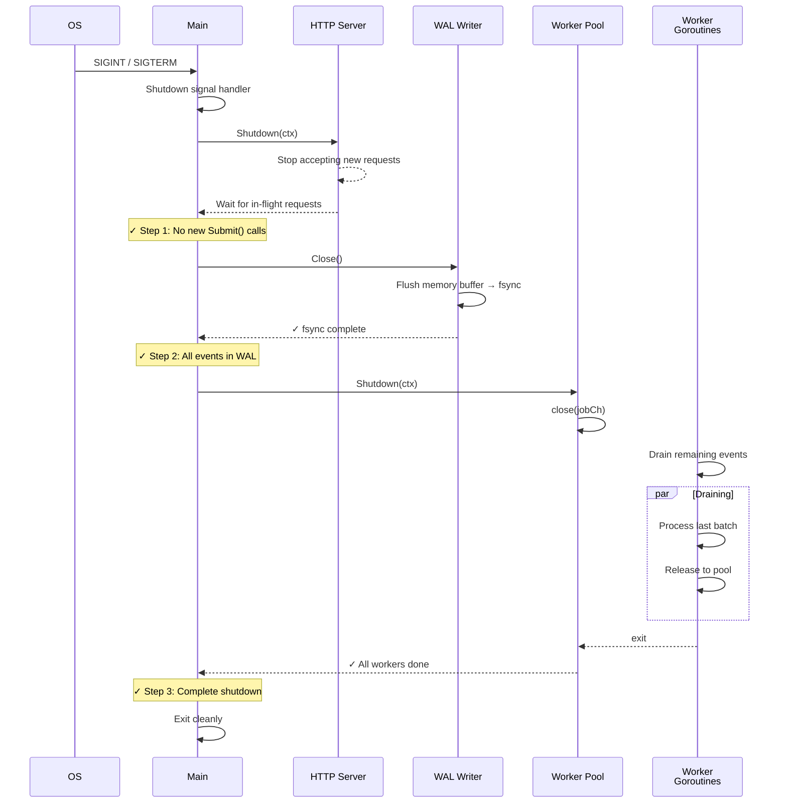
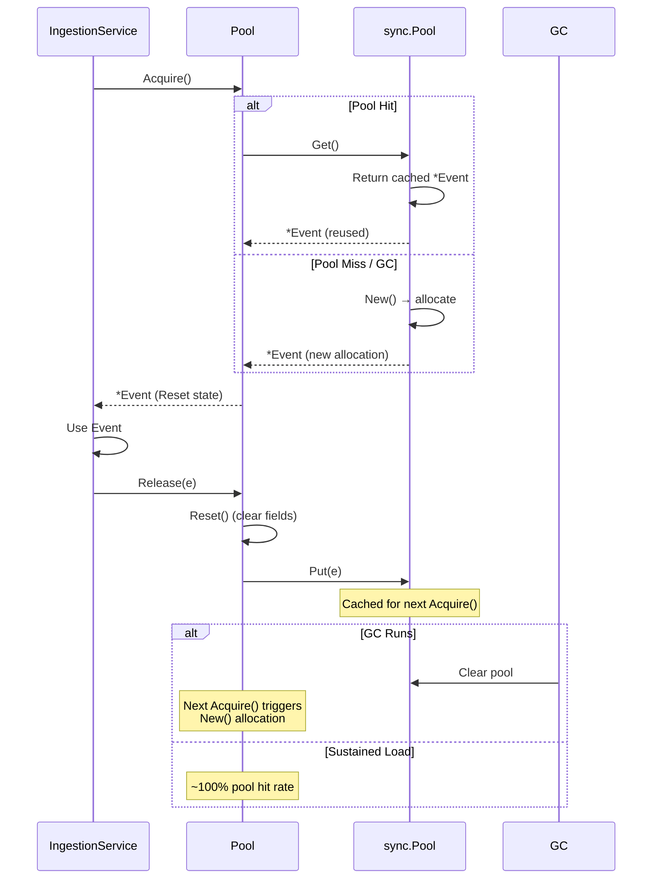

# Core-X 시퀀스 다이어그램

프로젝트의 전체 흐름도를 시퀀스 다이어그램으로 표현합니다.

---

## 1️⃣ HTTP 수집 요청 흐름 (Ingest Path)

---

## 2️⃣ 백그라운드 이벤트 처리 (Worker Pool)

---

## 3️⃣ Stats & Monitoring 엔드포인트

---

## 4️⃣ Graceful Shutdown (신호 → 종료)

---

## 5️⃣ 메모리 풀 재활용 (sync.Pool Lifecycle)

---

## 📊 주요 특징 요약

| 단계 | 책임 | 특징 |
|------|------|------|
| **HTTP Handler** | 요청 파싱 + 유효성 검사 | JSON 디코드, 필수 필드 검증 |
| **IngestionService** | 유스케이스 오케스트레이션 | Event 풀 관리, WAL 기록, Submit |
| **WorkerPool** | 비동기 처리 분산 | Non-blocking Submit, atomic 카운터 |
| **EventPool** | 메모리 재활용 | sync.Pool 기반, GC-aware |
| **WALWriter** | 내구성 보장 | Write-Ahead Log, fsync 정책 |
| **Graceful Shutdown** | 안전 종료 | 순서 보장 (HTTP → WAL → Workers) |

---

## 🏗️ 계층별 책임

### Domain Layer (`internal/domain`)
- **Event**: 수집 파이프라인의 데이터 단위
- **EventProcessor**: 이벤트 처리 인터페이스

### Application Layer (`internal/application/ingestion`)
- **IngestionService**: Ingest 유스케이스 오케스트레이션
- 포트 인터페이스: `Submitter`, `Stats`, `EventPool`, `WALWriter`

### Infrastructure Layer (`internal/infrastructure`)
- **HTTP Handler**: POST /ingest, GET /stats, GET /healthz
- **WorkerPool**: 비동기 워커 풀 (채널 기반)
- **EventPool**: sync.Pool 기반 메모리 풀
- **WALWriter**: Write-Ahead Log 디스크 저장

### Composition Root (`cmd/main.go`)
- 모든 의존성 생성 및 연결
- Graceful shutdown 순서 조율
