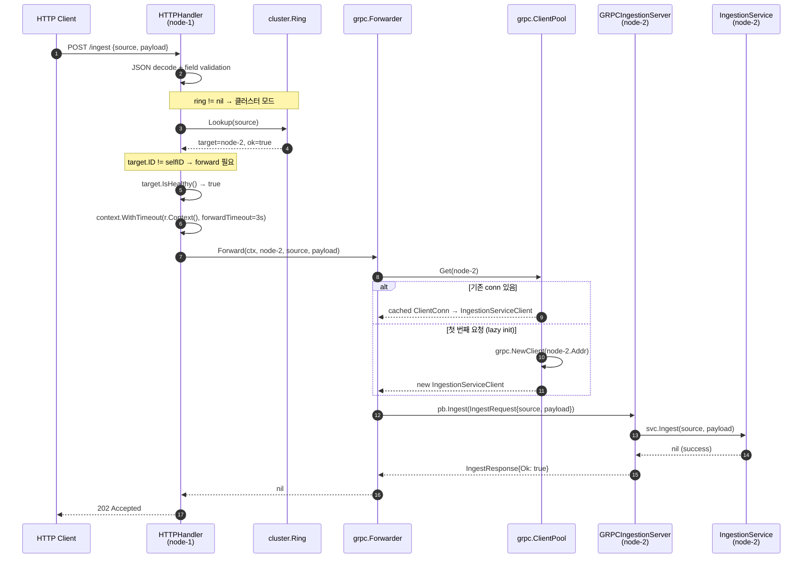
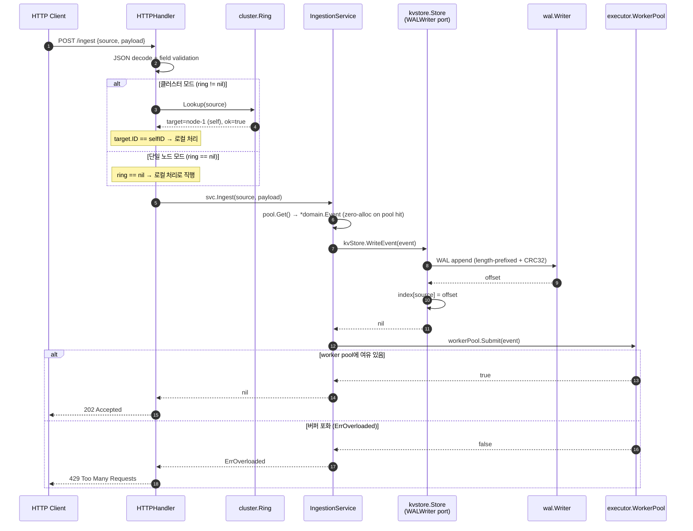
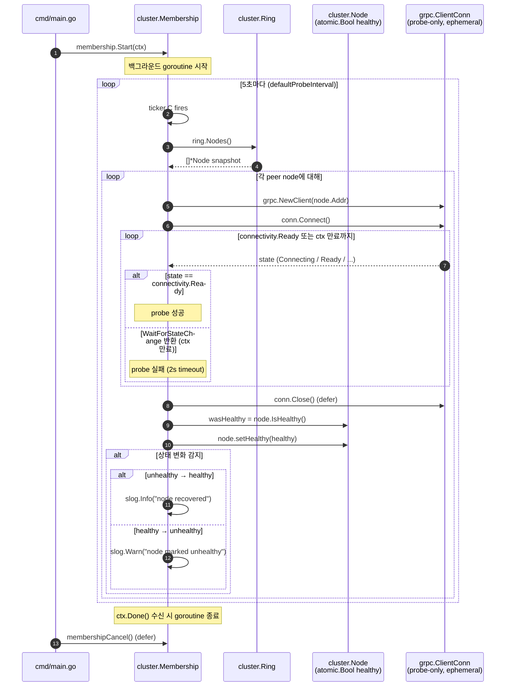

# Phase 3 gRPC 요청 흐름 시퀀스 다이어그램

Phase 3에서 추가된 클러스터 모드의 세 가지 핵심 흐름을 Mermaid sequenceDiagram으로 기술한다.
각 다이어그램은 실제 구현 코드(`handler.go`, `forward.go`, `client.go`, `ring.go`, `membership.go`)를 기반으로 작성되었다.

---

## 1. Forward Path — 담당 노드가 다른 피어인 경우

클라이언트가 `POST /ingest`를 보냈을 때, consistent hashing 결과 담당 노드가 자신이 아닌 경우의 흐름.
`Ring.Lookup(source)`으로 담당 노드를 결정하고, 노드가 healthy하면 `Forwarder.Forward()`가
`ClientPool`을 통해 피어에게 gRPC `Ingest` RPC를 호출한다.
피어의 `GRPCIngestionServer`는 동일한 `IngestionService`를 재사용하여 로컬 처리를 완료한다.

---

## 2. Local Path — 자신이 담당 노드인 경우 (단일 노드 모드 포함)

`Ring.Lookup` 결과 자신이 담당 노드이거나(`target.ID == selfID`), ring이 nil인 단일 노드 모드의 흐름.
두 경우 모두 `IngestionService.Ingest()`를 직접 호출하는 동일한 로컬 처리 경로로 진입한다.
KV Store가 WAL에 기록하고 Worker Pool에 이벤트를 제출하는 구조는 Phase 2와 동일하다.

---

## 3. Health Probe — 백그라운드 노드 상태 감지 루프

`cluster.Membership`이 백그라운드 goroutine에서 5초 간격으로 모든 피어 노드의 gRPC 연결 상태를 확인한다.
각 probe는 독립적인 `grpc.ClientConn`을 생성하고 `connectivity.Ready` 상태 전이를 2초 타임아웃 내에 기다린다.
상태 변화(healthy ↔ unhealthy)가 감지되면 `node.setHealthy()`가 `atomic.Bool`을 갱신하여
HTTP forwarding 경로의 `target.IsHealthy()` 판단에 즉시 반영된다.

